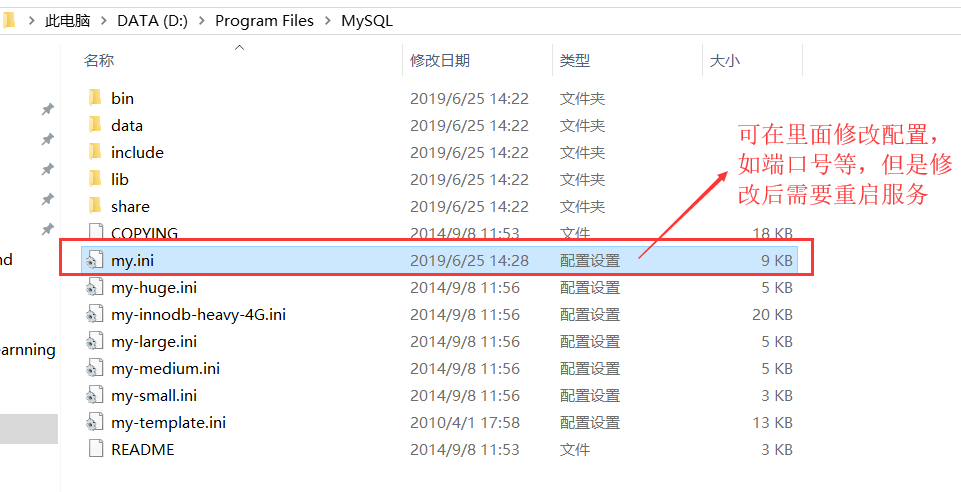
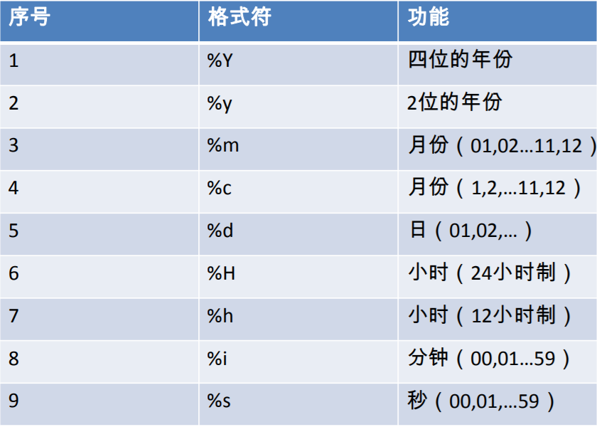

# MySQL数据库

## 数据库的概述
    1. 数据库的好处
        <1> 持久化数据到本地

        <2> 能够很好的实现结构化查询，方便管理

    2. 数据库的概念
        <1> DB(DataBase)：数据库，保存一组有组织的数据的容器

        <2> DBMS(DataBase Management System)：数据库管理系统，即数据库软件，用于管理数据库中的数据

        <3> SQL(Structure Query Langvage)：结构化查询语言，用于与DBMS进行连接通信

## MySQL的介绍与安装使用
    1. MySQL的介绍
        <1> 优点：
            1) 成本低：开放源代码，可以免费试用

            2) 性能高：执行快

            3) 简单：安装以及使用简单

        <2> DBMS的分类
            1) 基于共享文件系统的的DBMS(Acess)

            2) 基于客户机-服务器的DBMS(MySQL/Oracle/SqlServer)

    2. MySQL的安装使用
        <1> 下载好对应版本的MySql傻瓜式安装即可
            * 需要注意的是：
                - 在选择字符集是选择utf8
 
                - 需要选择配置Windows的环境变量

        <2> 配置文件

        <3> MySQL服务的启动与停止
            1) 方式一：直接在计算机中找到对应的MySQL服务，停止服务即可停止服务，点击启动即可启动服务 

            2) 方式二：命令行方式
                * 使用管理员身份打开cmd，输入命令net stop 服务名(MySQL)即可停止服务；输入命令net start 服务名(MySQL)
                  即可启动服务

        <4> MySQL服务的登录与退出
            1) 登录
                * 方式一：使用MySql提供的客户端输入密码即可直接登录(只适合root用户)

                * 方式二：打开cmd 输入 mysql -h localhost -P 3306 -u root -p

                    - 其中-h表示主机名，localhost表示连接本机(也可以指定IP)，-P是端口号，-u是指username，-p是password

                    - 简写方式：mysql -u用户名 -p密码(直接登录本机)

            2) 退出
                * 方式一：在MySQL客户端输入exit或者按下CTRL + C 

    3. MySQL的常见命令
        <1> 查看当前所有数据库
            show databases;

        <2> 打开指定的库(使用指定的库)
            use 库名;

        <3> 查看当前库的所有表
            show tables;

        <4> 查看其他库的所有表
            show tables from 库名

        <5> 创建表
            create table 表名(
                列名 列类型,
                列名 列类型
            );

        <6> 查看表结构
            desc 表名;

        <7> 查看MySQL版本
            方式一:登录mysql查看
                select version();

            方式二：cmd查看
                mysql --version

    4. MySQL的语法规范
        <1> 不区分大小写，但是建议关键字大写，表名、列名小写

        <2> 命令以分号结尾

        <3> 命令可以使用缩进或换行

        <4> 注释：
            1) 单行注释：#注释文字

            2) 单行注释：-- 注释文字

            3) 多行注释：/*注释文字*/

## DQL
    1. 基础查询
        <1> 语法：
            select 字段列表 from 表名
            
            字段列表可以是：表中字段，常量值，表达式，函数。查询的结果是一个虚拟的表格

        <2> 具体操作请参考(DQL基础查询.sql)

    2. 条件查询
        <1> 语法：
            select 查询列表 from 表名 where 筛选条件;

        <2> 分类
            1) 按条件表达式筛选。其中条件运算符有：<； >； =； !=； <>； >=； <=  

            2) 按逻辑表达式筛选。其中逻辑运算符有：&&； ||； !； and； or； not，其作用是用于连接条件表达式。
                * and（&&）:两个条件如果同时成立，结果为true，否则为false

                * or(||)：两个条件只要有一个成立，结果为true，否则为false

                * not(!)：如果条件成立，则not后为false，否则为true

            3) 模糊查询。比如：like；between and；in；is null
                * like
                    - 可以判断字符型，同样也可以判断数值型
                    - 一般like会与通配符配合使用。常用通配符有%(表示任意多个字符，包含0个字符)和_(表示任意单个字符)

                    - 注意：一般默认通配符为\，但是我们可以通过escape关键字指定某个字符为通配符使用
                        如  这里我们通过ESCAPE将字符x指定为通配符：last_name LIKE '_x_%' ESCAPE 'x';

                * between and
                    - 使用between and 可以提高语句的简洁度
                    - 包含临界值
                    - 两个临界值不要调换顺序

                * in
                    - 含义：判断某字段的值是否属于in列表中的某一项
                    - 使用in提高语句简洁度
                    - in列表的值类型必须一致或兼容
                    - in列表中不支持通配符

                * is null
                    - =或<>不能用于判断null值
                    - is null或is not null 可以判断null值

                * 安全等于：<=>

                * IS NULL:仅仅可以判断NULL值，可读性较高，建议使用
                  <=>    :既可以判断NULL值，又可以判断普通的数值，可读性较低

        <3> 具体操作请参考(DQL条件查询.sql)

    3. 排序查询
        <1> 语法：
            select 查询列表 from 表名 where 筛选条件 order by 排序列表(asc或desc);

        <2> 注意：
            1) asc代表的是升序，可以省略(默认是升序)，desc代表的是降序

            2) order by子句可以支持 单个字段、别名、表达式、函数、多个字段

            3) order by子句在查询语句的最后面，除了limit子句

            4) length(字段名)函数：表示获取字段名的长度

        <3> 具体操作请参考(DQL排序查询.sql)

    4. 常见函数
        <1> 概述
            1) 概念：类似于java的方法，将一组逻辑语句封装在方法体中，对外暴露方法名

            2) 好处：1、隐藏了实现细节  2、提高代码的重用性

            3) 调用：select 函数名(实参列表) from 表名;
        
            4) 分类：
                * 单行函数。如 concat、length、ifnull等
                * 分组函数。功能：做统计使用，又称为统计函数、聚合函数、组函数

        <2> 在mySql中索引是从1开始计算的

        <3> 单行函数

            1) 字符型(详细参考 常见函数之单行函数.sql)

            2) 数学型(详细参考 常见函数之单行函数.sql)

            3) 日期型(详细参考 常见函数之单行函数.sql)
                * 注意：str_to_date中常用的格式表格如下：
                

            4) 其他函数(详细参考 常见函数之单行函数.sql)

            5) 流程控制函数(详细参考 常见函数之单行函数.sql)

        <4> 分组函数
            1) 分类：sum 求和、avg 平均值、max 最大值 、min 最小值 、count 计算个数

            2) 特点：
                [1]sum、avg一般用于处理数值型。max、min、count可以处理任何类型

                [2]以上分组函数都忽略null值(null值不会参与运算)

                [3]可以和distinct搭配实现去重的运算

                [4]count函数的单独介绍。一般使用count(*)用作统计行数

                [5]和分组函数一同查询的字段要求是group by后的字段

            3) 详细参考 常见函数之分组函数.sql

    5. 分组查询
        <1> 语法：
            select 查询列表 from 表名 where 筛选条件 group by 分组的字段 order by 排序的字段;

            注意：
                1) 查询列表必须是分组函数或者group by后面出现的字段

                2) 如果order by 后面加上 having的话表示对添加分组后的筛选条件进行筛选

        <2> 分组查询的特点
            1) 筛选分为两类：

                序号     分组前筛选和分组后筛选	   针对的表			 位置		    连接的关键字

                1        分组前筛选	               原始表			 group by前	    where
                            
                2        分组后筛选	               分组后的结果集     group by后	    having

                [1] 分组函数做条件肯定是放在having子句中

                [2] 能用分组前筛选的，优先考虑使用分组前筛选

            2) group by子句支持单个字段分组，多个字段分组(多个字段分组使用逗号隔开)，表达式或函数(用得较少)

            3) 可以搭配着排序使用(排序放在整个分组查询最后)

        <3> 详细参考 常见函数之分组查询.sql

    6. 连接查询
        <1> 含义：又称多表查询，当查询的字段来自于多个表时，就会用到连接查询

        <2> 笛卡尔乘积现象：表1 有m行，表2有n行，结果=m*n行
            * 发生原因：没有有效的连接条件
            * 如何避免：添加有效的连接条件

        <3> 连接查询的分类
            1) 按年代分类：
                sql92标准:仅仅支持内连接
                sql99标准【推荐】：支持内连接+外连接（左外和右外）+交叉连接
	
            2) 按功能分类：
                内连接：
                    等值连接
                    非等值连接
                    自连接
                外连接：
                    左外连接
                    右外连接
                    全外连接
                交叉连接

        
        

            

       

            

        

