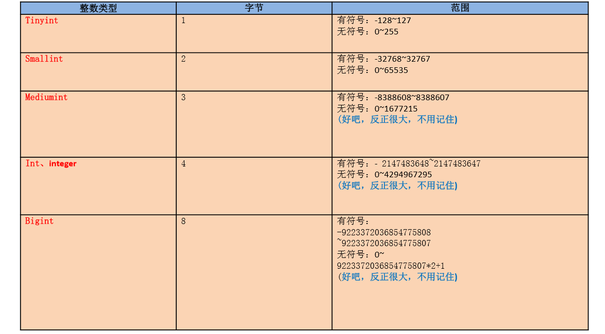
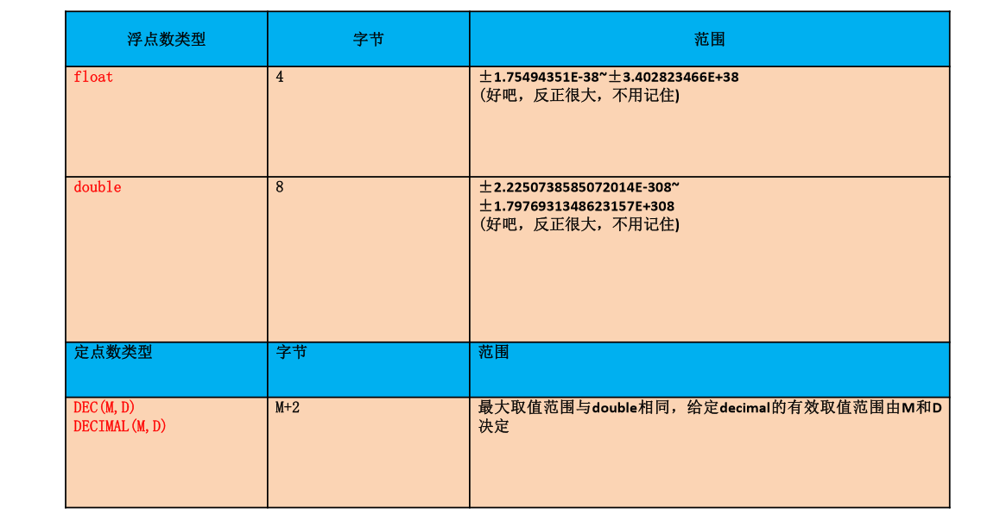
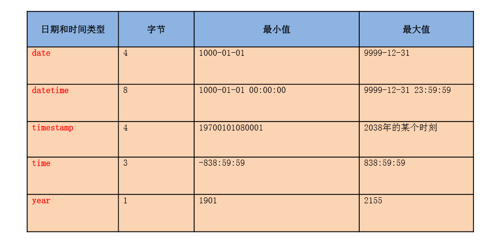

# MySQL数据库

## DML语言(Data Manipulation Language)数据操作语言

### 插入语句(insert)
    1. 经典插入
        <1> 语法：
                insert into 表名(列名,...) values(值1,...);

        <2> 特点：
            1) 插入的值的类型要与列的类型一致或兼容

            2) 不可以为null的列必须插入值。

            3) 列的顺序是可以调换的

            4) 列数和值的个数必须一致

            5) 可以省略列名，默认所有列，而且列的顺序和表中列的顺序一致

    2. 插入方式二
        <1> 语法:
            insert into 表名
            set 列名=值,列名=值,...

### 修改语句(update)
    1. 修改单表记录
        <1> 语法
                update 表名			        
                set 列=新值,列=新值,...		
                where 筛选条件;	

    2. 修改多表的记录
        <1> 语法
            * sql92语法：
                update 表1 别名,表2 别名
                set 列=值,...
                where 连接条件
                and 筛选条件;

            * sql99语法：
                update 表1 别名
                inner|left|right join 表2 别名
                on 连接条件
                set 列=值,...
                where 筛选条件;

### 删除语句(delete)
    1. 方式一：delete
        <1> 单表的删除
            1) 语法：
                delete from 表名 where 筛选条件

        <2> 多表的删除
            1) sql92语法：
                delete 表1的别名,表2的别名
                from 表1 别名,表2 别名
                where 连接条件
                and 筛选条件;

            2) sql99语法：
                delete 表1的别名,表2的别名
                from 表1 别名
                inner|left|right join 表2 别名 on 连接条件
                where 筛选条件;

    2. 方式二：truncate
        <1>语法：
            truncate table 表名;

        <2> 注意：这个语句中不能使用where进行限定，删除会将所有数据删除，所以叫做清空语句

    3. 方式一与方式二的区别
        <1> delete 可以加where 条件，truncate不能加

        <2> truncate删除，效率比较高

        <3> 假如要删除的表中有自增长列，如果用delete删除后，再插入数据，自增长列的值从断点开始，而truncate删除后，
            再插入数据，自增长列的值从1开始

        <4> truncate删除没有返回值，delete删除有返回值

        <5> truncate删除不能回滚，delete删除可以回滚

    4. 详细内容请参考(DML数据的增删改.sql)

## DDL((Data Definition Language)数据定义语言

### 库的管理
    1. 库的创建
        <1> 语法：
            create database  [if not exists]库名;
    
    2. 库的修改
        <1> 修改库名(由于安全性问题，现在已经废弃使用了)

            * rename database 库名 to 新库名;

        <2> 修改库的字符集
            * alter database 库名 character set 字符集编码(如：gbk，utf8);
    
    3. 库的删除
        <1> 语法:
            drop database if exists 库名;

### 表的管理
    1. 表的创建
        <1> 语法：
            create table 表名(
                列名 列的类型[(长度) 约束],
                列名 列的类型[(长度) 约束],
                列名 列的类型[(长度) 约束],
                ...
                列名 列的类型[(长度) 约束]
            );

    2. 表的修改
        <1> 语法：
            alter table 表名 add|drop|modify|change column 列名 [列类型 约束];

            注意：其中change可以不用加上column
        
        <2> 类型(详细参考DDL语言.sql)
            1) 修改列名

            2) 修改列的类型或约束

            3) 添加新列

            4) 删除列

            5) 修改表名
    
    3. 表的删除
        <1> 删除的通用语法：
            1) 删除库
                DROP DATABASE IF EXISTS 旧库名;
                CREATE DATABASE 新库名;

            2) 删除表
                DROP TABLE IF EXISTS 旧表名;
                CREATE TABLE  表名();

    4. 表的复制(详细参考DDL语言.sql)
        <1> 分类
            1) 仅仅复制表的结构

            2) 复制表的结构+数据

            3) 只复制部分数据

            4) 仅仅复制某些字段

        <2> 注意：
            * 表的复制时可以跨库执行的，只需要在表名前使用库名指定即可，如下：
                create table 表名 select 字段1,字段2... from 库名.表名

### 常见的数据类型
    1. 分类
        <1> 数值型：
            1) 整型

            2) 小数：
                * 定点数
                * 浮点数
        <2> 字符型：
            1) 较短的文本：char、varchar

            2) 较长的文本：text、blob（较长的二进制数据）

        <3> 日期型

    
    2. 整型 
        <1> 首先查看一下整型的几种类型，如下所示

        <2> 分类：

            类型    tinyint、smallint、mediumint、int/integer、bigint
            字节      1	        2		  3	           4		8

        <3> 特点
            1) 如果不设置无符号还是有符号，默认是有符号，如果想设置无符号，需要添加unsigned关键字

            2) 如果插入的数值超出了整型的范围,会报out of range异常，并且插入临界值

            3) 如果不设置长度，会有默认的长度。长度代表了显示的最大宽度，如果不够会用0在左边填充，但必须搭配
               zerofill使用

    3. 小数型
        <1> 首先查看一下小数的几种类型，如下所示

        

        <2> 分类
            1) 浮点型
                    float(M,D)

                    double(M,D)

            2) 定点型
                    dec(M，D)

                    decimal(M,D)

        <3> 特点
            1) D表示小数点后显示几位,M代表整数部位和小数不位总共显示几位,如果超过范围，则插入临界值

            2) M和D都可以省略。如果是decimal，则M默认为10，D默认为0。如果是float和double，则会根据插入的数值的精度
               来决定精度

            3) 定点型的精确度较高，如果要求插入数值的精度较高如货币运算等则考虑使用

        <4> 选择使用哪种类型的原则
            * 所选择的类型越简单越好，能保存数值的类型越小越好

    4. 字符型
        <1> 分类
            1) 较短的文本：
                * char
                * varchar

                * 其他：
                    - binary和varbinary用于保存较短的二进制
                    - enum用于保存枚举
                    - set用于保存集合

            2) 较长的文本：
                * text
                * blob(较大的二进制)

        <2> 特点

                    写法		           M的意思					      特点	     空间的耗费	   效率
            char	char(M)		 最大的字符数，可以省略，默认为1	  固定长度的字符	    比较耗费	       高

            varchar varchar(M)	 最大的字符数，不可以省略		      可变长度的字符	     比较节省	    低

    5. 日期型
        <1> 首先查看一下日期型的几种类型，如下所示

    

        <2> 分类：
            * date:只保存日期

            * time:只保存时间

            * year:只保存年

            * datetime:保存日期+时间（占8个字节）

            * timestamp:保存日期+时间（占4个字节）

        <2> datetime与timestamp的区别
            1. Timestamp支持的时间范围较小，取值范围：1970-01-01-08:00:01到2038年的某个时间 
               Datetime的取值范围：1000-1-1 到 9999—12-31

            2. timestamp和实际时区有关，更能反映实际的日期，而datetime则只能反映出插入时的当地时区
            
            3. timestamp的属性受Mysql版本和SQLMode的影响很大

### 常见约束
    1. 含义：
        * 是一种限制，用于限制表中的数据，为了保证表中的数据的准确和可靠性

    2. 分类(六大约束)
        <1> NOT NULL：非空，用于保证该字段的值不能为空。比如姓名、学号等

        <2> DEFAULT:默认，用于保证该字段有默认值。比如性别

        <3> PRIMARY KEY:主键，用于保证该字段的值具有唯一性，并且非空。比如学号、员工编号等
        
        <4> UNIQUE:唯一，用于保证该字段的值具有唯一性，可以为空。比如座位号

        <5> CHECK:检查约束[mysql中不支持]。比如年龄、性别

        <6> FOREIGN KEY:外键，用于限制两个表的关系，用于保证该字段的值必须来自于主表的关联列的值。在从表添加外键约束，
                        用于引用主表中某列的值。比如学生表的专业编号，员工表的部门编号，员工表的工种编号

    3. 约束的添加分类：
        <1> 列级约束：(不支持起名字)
            * 六大约束语法上都支持，但外键约束没有效果
            
        <2> 表级约束：
		    * 除了非空、默认，其他的都支持

    4. 添加约束的时机：
        <1> 创建表时
            1) 添加列级约束
                * 语法：
                    直接在字段名和类型后面追加 约束类型即可。只支持：默认、非空、主键、唯一

            2) 添加表级约束
                * 语法：
                    在各个字段的最下面添加约束，[constraint 约束名] 约束类型(字段名) 

        <2> 修改表时
            1) 添加列级约束
                * 语法：
                    alter table 表名 modify column 字段名 字段类型 新约束;

            2) 添加表级约束
                * 语法：
                    alter table 表名 add 【constraint 约束名】 约束类型(字段名) 【外键的引用】;

            3) 删除约束(参考常见约束.sql)
                * 与上面修改表时添加约束类似，只需要去掉约束即可

    5. 添加约束时的语法

            CREATE TABLE 表名(
                字段名 字段类型 列级约束,
                字段名 字段类型,
                表级约束
            );
    
    6. 主键约束与唯一约束的对比
        <1> 主键约束与唯一约束都可以保证唯一性

        <2> 主键约束不予许为空，唯一约束允许为空，但是唯一约束只允许一个为空

        <3> 主键约束一个表中最多只能有一个，而唯一约束可以有多个

        <4> 主键约束和唯一约束都可以组合(两个字段组合使用该约束)使用，但不推荐使用
    
	7. 外键
        <1> 要求在从表设置外键关系

        <2> 从表的外键列的类型和主表的关联列的类型要求一致或兼容，名称无要求

        <3> 主表的关联列必须是一个key（一般是主键或唯一键）。如果不是的话就会关联失败，从而报错

        <4> 插入数据时，先插入主表，再插入从表删除数据时，先删除从表，再删除主表	

    8. 标识列(自增长)
        <1> 含义：又称为自增长列。可以不用手动的插入值，系统提供默认的序列值

        <2> 特点：
            1) 标识列必须和主键搭配吗？不一定，但要求是一个key

            2) 一个表可以有几个标识列？至多一个

            3) 标识列的类型只能是数值型(如int float等)

            4) 标识列可以通过 SET auto_increment_increment=3;设置步长。也可以通过手动插入值，设置起始值
    
                

        