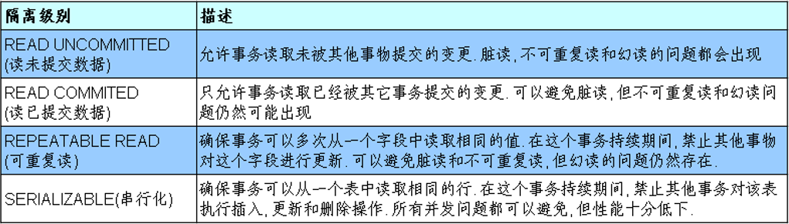
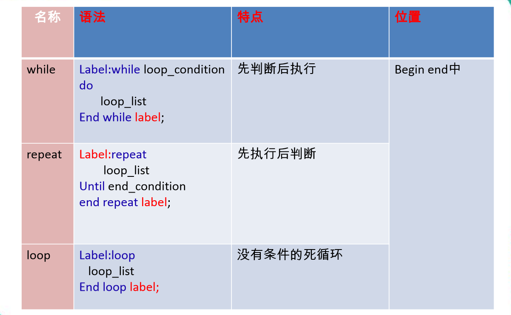

# MySQL数据库

## TCL(Tansaction Conctrol Language)事务控制语言

### 事务
    1. 概念：   
        * 事务：一个或一组sql语句组成一个执行单元，这个执行单元要么全部执行，要么全部不执行。

    2. 事务的特性(ACID)：
        <1> 原子性(Atomicity)：一个事务不可再分割，要么都执行要么都不执行
        
        <2> 一致性(Consistency)：一个事务执行会使数据从一个一致状态切换到另外一个一致状态。即事务操作前后,数据总量不变

        <3> 隔离性(Isolation)：一个事务的执行不受其他事务的干扰

        <4> 持久性(Durability)：一个事务一旦提交，则会永久的改变数据库的数据

    3. 事务的分类
        <1> 隐式事务：事务没有明显的开启和结束的标记

        <2> 显式事务：事务具有明显的开启和结束的标记。前提：必须先设置自动提交功能为禁用---> set autocommit=0;

        <3> 开启事务的步骤
            	1) 步骤1：开启事务
                    set autocommit=0;
                    start transaction;(可选的)

                2) 步骤2：编写事务中的sql语句(select insert update delete)
                    语句1;
                    语句2;
                    ...

                3) 步骤3：结束事务
                    commit;提交事务
                    rollback;回滚事务

    4. 事务的隔离级别
        <1> 对于同时运行的多个事务, 当这些事务访问数据库中相同的数据时, 如果没有采取必要的隔离机制, 会导致各种并发问题:
            1) 脏读:一个事务读取到另一个事务中没有提交的数据

            2) 不可重复读:在同一个事务中,两次读取到的数据不一样

            3) 幻读:一个事务操作（DML）数据表中所有记录,另一个事务添加了一条数据,则第一个事务查询不到自己的修改

        <2> 一个事务与其他事务隔离的程度称为隔离级别。数据库规定了多种事务隔离级别, 不同隔离级别对应不同的干扰程度, 隔
            离级别越高, 数据一致性就越好, 但并发性越弱

        <3> 事务的四种隔离级别

        <4> 隔离级别用到的命令
            1) 查看当前的隔离级别: SELECT @@tx_isolation;
            
            2) 设置当前 mySQL 连接的隔离级别: set session transaction isolation level read committed; 
            
            3) 设置数据库系统的全局的隔离级别: set global transaction isolation level read committed;

## 视图
    1. 概念
        视图：MySQL从5.0.1版本开始提供视图功能。一种虚拟存在的表，行和列的数据来自定义视图的查询中使用的表 ，并且是在使
              用视图时动态生成的，只保存了sql逻辑，不保存查询结

    2. 视图的创建
        <1> 语法：
                create view 视图名
                as
                查询语句;

    3. 视图的修改
        <1> 方式一：
                create or replace view  视图名(存在就替换，不存在就创建)
                as
                查询语句;

        <2> 方式二：
                alter view 视图名
                as 
                查询语句;

    4. 视图的删除
        <1> 语法：
                drop view 视图名,视图名,...;

    5. 视图的查看
        <1> 方式一：
                desc 视图名;

        <2> 方式二：
                show create view 视图名;

    6. 视图的更新
        <1> 描述：通过视图更新表中的数据

        <2> 分类(语法与更改表中的数据类似)
            1) 插入
            
            2) 修改
            
            3) 删除

        <3> 注意：具备以下特点的视图不允许更新
            1) 包含以下关键字的sql语句：分组函数、distinct、group  by、having、union或者union all

            2) 常量视图(包含常量)如：SELECT 'john' NAME;

            3) Select中包含子查询
            
            4) 含有join关键字

            5) from一个不能更新的视图

            6) where子句的子查询引用了from子句中的表

        7. 表与视图的对比

            创建语法的关键字	           是否实际占用物理空间	        使用

            视图	create view		   只是保存了sql逻辑	            增删改查，只是一般不能增删改

            表	create table		   保存了数据		            增删改查

## 变量
    1. 变量的分类
        <1> 系统变量：
            1) 全局变量
                * 作用域：服务器，每次启动将为所有的全局变量赋予初始值，针对于所有会话（连接）有效，但不能跨重启

            2) 会话变量
                * 作用域：针对于所有会话（连接）有效，但不能跨重启

        <2> 自定义变量：
            1) 用户变量
                * 作用域：针对于当前会话（连接）有效，作用域同于会话变量
            2) 局部变量
                * 

    2. 系统变量
        <1> 定义：变量由系统定义，不是用户定义，属于服务器层面

        <2> 语法：
            * 注意：全局变量需要添加global关键字，会话变量需要添加session关键字，如果不写，默认会话级别

                1) 查看所有系统变量
                        show global|[session]variables;

                2) 查看满足条件的部分系统变量
                        show global|[session] variables like '%character%';

                3) 查看指定的系统变量的值
                        select @@global|[session]系统变量名;

                4) 为某个系统变量赋值
                    * 方式一：
                        set global|[session]系统变量名=值;
                    * 方式二：
                        set @@global|[session]系统变量名=值;

    3. 自定义变量
        <1> 定义：变量由用户自定义，而不是系统提供的

        <2> 用户变量：
            * 注意：作用域：针对于当前会话（连接）有效，作用域同于会话变量

            1) 声明并初始化
                    SET @变量名=值;
                    SET @变量名:=值;
                    SELECT @变量名:=值;

            2) 赋值（更新变量的值）
                    * 方式一：
                        SET @变量名=值;
                        SET @变量名:=值;
                        SELECT @变量名:=值;

                    * 方式二：
                        SELECT 字段 INTO @变量名
                        FROM 表;

            3) 使用（查看变量的值）
                    SELECT @变量名;

        <3> 局部变量
            * 注意：作用域：仅仅在定义它的begin end块中有效，应用在 begin end中的第一句语句

            1) 声明并初始化
                    SET @变量名=值;
                    SET @变量名:=值;
                    SELECT @变量名:=值;

            2) 赋值（更新变量的值）
                * 方式一：
                    SET @变量名=值;
                    SET @变量名:=值;
                    SELECT @变量名:=值;

                * 方式二：
                    SELECT 字段 INTO @变量名
                    FROM 表;

            3) 使用（查看变量的值）
	                SELECT @变量名;

        <4> 用户变量和局部变量的对比

            作用域		                     定义位置                语法
            用户变量	当前会话		            会话的任何地方		    加@符号，不用指定类型
            局部变量	定义它的BEGIN END中 	    BEGIN END的第一句话     一般不用加@,需要指定类型
    

## 存储过程与函数

### 存储过程
    1. 含义：一组预先编译好的SQL语句的集合，理解成批处理语句
       
    2. 存储过程的好处：
        <1> 提高代码的重用性
        <2> 简化操作
        <3> 减少了编译次数并且减少了和数据库服务器的连接次数，提高了效率

    3. 创建语法：
        <1> 语法：
            create procedure 存储过程名(参数列表)
            begin
                存储过程体(一组合法的SQL语句)
            end

        <2> 注意
            1) 参数列表包含三部分：参数模式、参数名、参数列表

                * 参数模式
                    - in：该参数可以作为输入，也就是说该参数需要调用方传入值

                    - out：该参数可以作为输出，也就是该参数可以作为返回值

                    - inout：该参数既可以作为输入，也可以作为输出，也就是该参数既需要传入值又可以返回值

                * 如果存储过程体仅仅只有一句话，那么可以省略begin...end

                * 存储过程中的每条sql语句的结尾都需要以分号结尾。存储过程的结尾可以使用 delimiter 重新设置

                    - 语法：
                        delimiter 结束标记
                
                    - 例如：
                        delimiter $

    4. 调用语法:
        call 存储过程名(实参列表) 【需要结束标记】

    5. 删除存储过程(只能一次删除一个)
        <1> 语法：
                drop procedure 存储过程名;
    
    6. 查看存储过程的信息
        <1> 语法
            SHOW CREATE PROCEDURE 存储过程名;

### 函数
    1. 函数与存储过程区别
        <1> 存储过程：可以有0个返回，也可以有多个返回，适合做批量插入、批量更新
            函数：有且仅有1 个返回，适合做处理数据后返回一个结果       

    2. 创建语法：
        <1> 语法：
            CREATE FUNCTION 函数名(参数列表) RETURNS 返回类型
            BEGIN
                函数体
            END

        <2> 注意
            1) 参数列表 包含两部分：参数名 参数类型

            2) 函数体：肯定会有return语句，如果没有会报错。如果return语句没有放在函数体的最后也不报错，但不建议
                       return 值;

            3) 函数体中仅有一句话，则可以省略begin end

            4) 使用 delimiter语句设置结束标记(结束标记可以设置多个符号如:delimiter !$ 等)

    3. 调用语法
        SELECT 函数名(参数列表) 【需要结束标记】

    4. 查看函数
        SHOW CREATE FUNCTION myf3;

    5. 删除函数
        DROP FUNCTION myf3;

 
## 流程控制结构 
    1. 分类
        <1> 顺序结构：程序从上自下依次执行

        <2> 分支结构：程序冲两条或者多条路径中选择一条去执行

        <3> 循环结构：程序在满足一定条件的基础上，重复执行一段代码

    2. 分支结构
        <1> if 函数
            1) 功能：实现简单的双分支

            2) 语法：
                if(表达式1，表达式2,表达式3)
            
            3) 执行顺序
                如果表达式1成立，则if函数返回表达式2的值，否则返回表达式3的值

            4) 应用场景：任何地方

        <2> case 结构
            1) 情况1：类似于switch，一般用于实现等值判断

                * 语法：
                        case 变量或表达式或字段
                        when 值1 then 返回值1或语句1;
                        when 值2 then 返回值2或语句2;
                        ...
                        else 要返回的值n或语句n;
                        end case;-- 如果是语句需要加上

            2) 情况2：类似于java中多重if语句，一般用于实现区间判断

                * 语法：
                        case 
                        when 条件1 then 返回值1或语句1;
                        when 条件2 then 返回值2或语句2;
                        ...
                        else 要返回的值n或语句n;
                        end case;-- 如果是语句需要加上

            3) 特点：
                * 可以作为表达式，嵌套在其他语句中使用，可以放在任何地方，BEGIN END中
                或BEGIN END的外面可以作为独立的语句去使用，只能放在BEGIN END中
        
                * 如果WHEN中的值满足或条件成立，则执行对应的THEN后面的语句，并且结束
                CASE如果都不满足，则执行ELSE中的语句或值

                * ELSE可以省略，如果ELSE省略了，并且所有WHEN条件都不满足，则返回NULL

        <3> if结构
            1) 语法：
                	if 条件1 then 语句1;
                    elseif 条件2 then 语句2;
                    ....
                    else 语句n;
                    end if;

	        2) 功能：类似于多重if

	        3) 应用场景：只能应用在begin end 中

    3. 循环结构
        <1> 分类：
                while、loop、repeat
        
        <2> 循环控制：
            1) iterate类似于 continue，继续，结束本次循环，继续下一次
            
            2) leave 类似于  break，跳出，结束当前所在的循环

        <3> while
            * 语法：
                【标签:】while 循环条件 do
                    循环体;
                end while【 标签】;

        <4> loop
            * 语法：	
                【标签:】loop
                    循环体;
                end loop 【标签】;

            * 可以用来模拟简单的死循环

        <5> repeat 
            * 语法：
                【标签：】repeat
                    循环体;
                until 结束循环的条件
                end repeat 【标签】;

        <6> 对比表

    