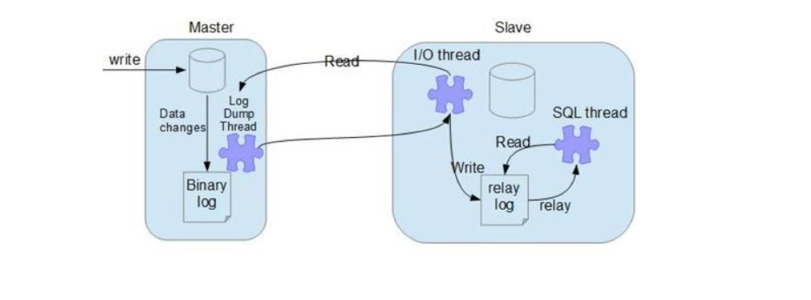

# Mysql优化

## 逻辑架构

### 逻辑分层
    1. 连接层
        最上层是一些客户端和连接服务，包含本地sock通信和大多数基于客户端/服务端工具	实现的类似于tcp/ip的通信。主要完成一些类似于连接处理、授权认证、及相关的安全	方案。

    2. 服务层
        Management Serveices & Utilities： 系统管理和控制工具  
        
        SQL Interface:  SQL接口，接受用户的SQL命令，x并且返回用户需要查询的结果。

        Parser: 解析器，SQL命令传递到解析器的时候会被解析器验证和解析。 

        Optimizer:查询优化器。SQL语句在查询之前会使用查询优化器对查询进行优化。

        Cache和Buffer:查询缓存。获取数据会查询缓存，缓存命中则返回，未命中则查询数据库。在配置文件中添加
                      query_cache_type=1即可开启缓存


    3. 引擎层
        主要有：MyISAM(不支持行锁)、InnoDB、Archive（适合日志和数据采集类应用）、Memory、Federated（访问其他服
        务器的代理）、Blackhole(没有存储机制，会丢弃插入的数据)等

    4. 存储层
        数据存储层，主要是将数据存储在运行于裸设备的文件系统之上，并完成与存储引擎的交互。

### mysql数据库的执行流程

```
​	首先一个sql会到Connectors，然后在connction pool中获取到一个连接，然后到cache 和buffer中查询是否有缓存 ，
   如果缓存命中，直接返回，如果缓存未命中，就会来到Sql接口层，该层负责接收sql和返回查询结果，接着来到parser解析
   器中，解析器会解析和验证sql命令，完成好之后，来到optimizer优化器，优化器会对sql进行优化，比如会选择先执行哪
   一部分，然后在执行哪一部分，最后会从磁盘中获取数据，返回给缓存以及客户端

```
## 存储引擎

    1. MyISAM与InnoDB的区别
        <1> MyISAM不支持外键，InnoDB支持外键

        <2> MyISAM不支持事务，InnoDB支持事务

        <3> MyISAM使用表锁，查询一条数据也会锁住整个表，不适合高并发，InnoDB使用行锁，操作时，只会锁住一行数据，适合高并发

        <4> MyISAM只存储索引不存储数据，InnoDB既要存储索引又会存储数据

        ​	 MyISAM经常作为系统表的引擎

## 索引
    1. 索引的概念
        索引是一种数据结构，简单理解为是一种排好序的快速查找的一种数据结构。索引有两大功能排序和查找

    2. 索引的优势与劣势
        优势：
            提高数据查找的效率，降低io成本
            通过索引对数据排序，降低了数据的排序的成本

        劣势：
            创建索引，需要占用一定的空间
            拥有索引，在更新表时，速度降低了，因为需要更新索引

    3. 索引分类
        主键索引
            设定为主键后数据库会自动建立索引，innodb为聚簇索引
   
        单值索引
        
        唯一索引
            索引列的值必须唯一，但允许有空值
        
        复合索引
            复合索引，mysql从左到右的使用索引中的字段,一个查询可以只使用索引的一部分是有顺序的，只能从左到右使用索引查询
            
        建立原则：但我们需要频繁使用到某字段，并且确定字段使用的顺序的时候就能使用复合索引，

    4. 哪些情况需要创建索引
	    主键自动建立唯一索引
		频繁作为查询条件的字段应该创建索引
		两个表之间存在外键关联，那这个外键也应该建立索引
		单键索引与组合索引相对比，组合索引性价比更高
		查询中排序的字段，排序字段若通过索引去访问将大大提高排序速度
		查询中统计或者分组字段

    5. 哪些情况不要创建索引
		表记录太少
		经常增删改的表或者字段
		Where条件里用不到的字段不创建索引
		过滤性不好的不适合建索引

## 执行计划explain
    
## 主从复制

### 主从复制概述

    1. 为什么需要使用主从赋值
        在生产环境中，如果只有一台数据库服务器，容易产生单点故障，服务器宕机，主从复制可以很好的解决这个问题

### 主从复制原理
    1. 原理概述
        首先，主节点接收到写的请求后，会开启一个log dump 线程，将这些sql存储在一个二进制的日志文件之中，从节点就会开
        启一个io线程读取该文件到本地，然后再开启一个sql线程，将该文件进行重放

    2. 原理流程图



### 一主一从的主从复制搭建
    1. 创建两个mysql实例
        <1> 在mysql目录下，创建data目录并在该目录下创建两个文件夹3307和3308
            cd mysql-5.7.24
            mkdir data
            cd data
            mkdir 3307
            mkdir 3308
        
        <2> 执行数据库的初始化(此步骤可省略)
            initialize-insecure 表示不生成MySQL数据库root用户的随机密码，即root密码为空

            mysqld --initialize-insecure --basedir=/usr/local/software/mysql-5.7.24 --datadir=/usr/local/software/mysql-5.7.24/data/3307 --user=mysql

            mysqld --initialize-insecure --basedir=/usr/local/software/mysql-5.7.24 --datadir=/usr/local/software/mysql-5.7.24/data/3308 --user=mysql

        <3> 分别在3307和3308下创建my.cnf配置文件（注意在3308下需要修改端口号）

            vim my.cnf

```
[client]
port        = 3307
socket      = /usr/local/software/mysql-5.7.24/data/3307/mysql.sock
default-character-set=utf8

[mysqld]
port    = 3307
socket  = /usr/local/software/mysql-5.7.24/data/3307/mysql.sock
datadir = /usr/local/software/mysql-5.7.24/data/3307
log-error = /usr/local/software/mysql-5.7.24/data/3307/error.log
pid-file = /usr/local/software/mysql-5.7.24/data/3307/mysql.pid

character-set-server=utf8
lower_case_table_names=1
autocommit = 1

```
        <4> 启动两个实例mysql
            其中 --defaults-file 是指定配置文件，& 符合表示后台启动

            mysqld_safe --defaults-file=/usr/local/software/mysql-5.7.24/data/3307/my.cnf &
		    mysqld_safe --defaults-file=/usr/local/software/mysql-5.7.24/data/3308/my.cnf &

        <5> 关闭两个实例
            mysqladmin -uroot -p -P3307 -h127.0.0.1 shutdown
		    mysqladmin -uroot -p -P3308 -h127.0.0.1 shutdown

    2. 修改对应的配置文件
        3307配置如下

```        
log-bin=mysql-bin       #表示启用二进制日志
server-id=3307          #表示server编号，编号要唯一
binlog_format=STATEMENT #设置logbin格式(默认)
        
```
        3308只需要配置  server-id=3308

    3. 重启mysql
        mysqld_safe --defaults-file=/usr/local/software/mysql-5.7.24/data/3307/my.cnf &
		mysqld_safe --defaults-file=/usr/local/software/mysql-5.7.24/data/3308/my.cnf &

    4. 配置主服务器
        <1> 登录到主服务器3307的客户端
            mysql -uroot -p -P3307 -h127.0.0.1

        <2> 在主服务器上创建复制数据的账号并授权
            grant replication slave on *.* to 'copy'@'%' identified by 'root';
        
        <3> 查看主服务器状态
			show master status;

            mysql主服务器默认初始值：
				File：mysql-bin.000001
				Position：154

		    如果主服务状态不是初始状态，需要重置状态
			    reset master;

    5. 配置从服务器
        <1> 需要登录到从服务器3308的客户端
			mysql -uroot -p -P3308 -h127.0.0.1
 
        <2> 如果从服务器不是初始状态，建议重置一下
            show slave status \G;   # 查看状态
            stop slave; 	        #停止复制，相当于终止从服务器上的IO和SQL线程
			reset slave;
        
        <3> 设置从服务器的master
            change master to master_host='192.168.43.129',master_user='copy',
            master_port=3307,master_password='root',
            master_log_file='mysql-bin.000001',master_log_pos=154;

        <4> 在从机器上执行开始复制命令
            start slave;

        <5> 若主从复制失效了 需要在主机(3307)上执行下面操作
            reset master;	
            stop slave;		
            reset slave;	
            start slave;

    6. 检验主复制搭建是否成功
        <1>	在从服务器的客户端执行以下命令：show slave status \G;
            \G表示格式化输出
			如果 Slave_IO_Running和Slave_SQL_Running 均为YES，则表示主从关系正常

        <2> 在主服务器上创建数据库/表/数据 在从服务器上查看是否已经复制
			1) 在sqlyog主服务器上创建库test，查看从服务器情况
			2) 在sqlyog主服务器上test库创建表user(id,name)看从服务器情况
			3) 在sqlyog主服务器上test库user中添加数据，查看从服务器情况

		<3> 查看主从复制binlog日志文件内容
			在主服务器客户端执行：show binlog events in 'mysql-bin.000001'\G;

